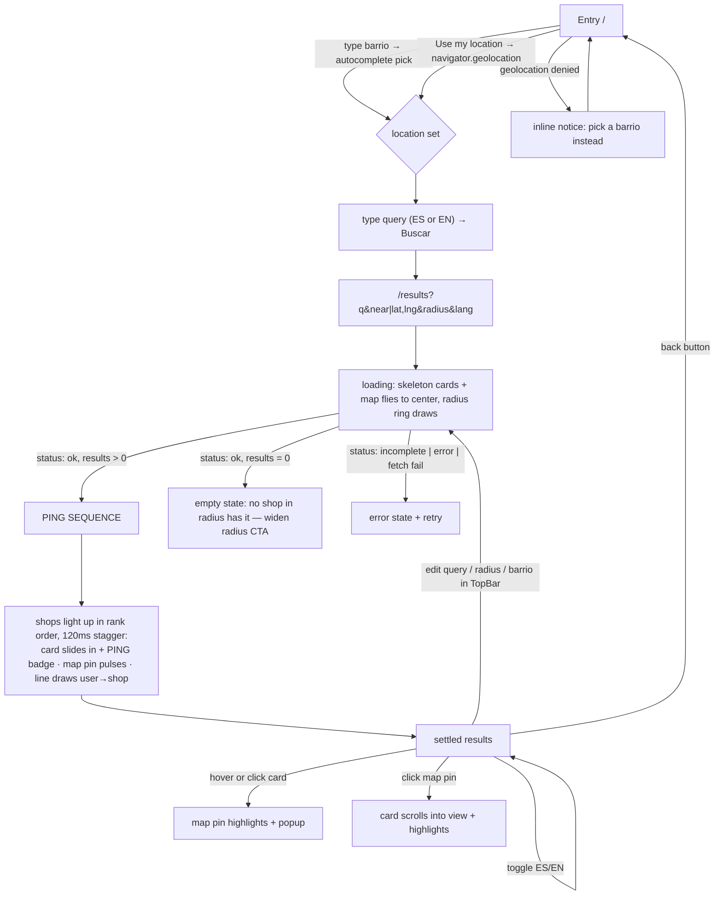

# ReachOut UI — Design Spec (Madrid MVP)

Date: 2026-07-07
Status: awaiting approval
Scope: the visual/UI phase for `frontend/` — the phase that `frontend/README.md`
explicitly deferred. Architecture (routes, TanStack Query, URL-as-state, typed
fetchers, generated types) is already in place and is **not** changed by this
design; the UI drops into it.

---

## 1. Product framing

Anti-Amazon hyperlocal shop finder. A shopper in Madrid searches for a real
item and sees which shops within a radius have it in stock now, with "live
ping" feedback. Two screens: **Entry** (where are you + what do you need) and
**Results** (Google-Maps-style split view: ranked shop cards left, MapLibre
map right). Dense, data-rich, warm — Bloomberg terminal meets mercado de
barrio. The city's live inventory network is the hero visual.

## 2. Decisions that shape the build

These resolve gaps between the brief and the existing contracts.

### D1 — `pinged` is client-side presentation state, not a schema field
The brief's API shape includes `pinged: bool`. The ranked-shops schema does
not, and `additionalProperties: false` makes it a hard gate. In the product
model every matched shop **is** pinged — a separate boolean carries no fact.
The "live ping" feel is timing, which is presentation: when results arrive,
the frontend runs a staggered ping sequence (rank order, ~120 ms apart); a
shop is "pinged" once its ping has fired in this search. **No schema or
backend change.** A `usePingSequence` hook owns this state.

### D2 — Network layer needs one small backend addition: `GET /api/shops.geojson`
The map should show ~50 pins (the whole known-shop network) with matched
shops highlighted — but `/api/search.geojson` only returns matches. Shops
live in `reachout/data/reachout.db`. Add one read-only endpoint returning a
plain FeatureCollection of all shops (`shop_id`, `shop_name`, `category`,
coordinates only — no inventory). Pure Python, no AI stage, consistent with
the scripts/stages split. New schema file `shops_geojson.schema.json` first,
endpoint second, generated type third — per the repo rule.

### D3 — Neighbourhood autocomplete is a bundled static list
`data/gazetteer_madrid.json` already names the well-known barrios. Bundle a
frontend copy of the names + centroids (`src/data/barrios.ts`, generated or
hand-synced from the gazetteer). Autocomplete only needs names; the `near`
param is resolved server-side as today. No geocoding API, no new endpoint.

### D4 — Language is a URL param (`lang=es|en`), default `es`
Keeps URL-as-state intact and shareable. A ~40-key dictionary module
(`src/i18n/strings.ts`) with a `useLang()` hook. Item names, shop names, and
addresses come from data and are never translated.

### D5 — Radius slider writes `radius` (km) to the URL, debounced 400 ms
Range 0.5–5 km (brief's 500 m–5 km), default 2. Changing it re-fires both
queries via the existing query-key-is-URL-params mechanism — no new state.

## 3. User flow



Entry state details:
- Full-screen, centered column. Headline: "¿Dónde estás en Madrid?" / "Where
  are you in Madrid?".
- Barrio autocomplete (combobox over the static list, accent-insensitive
  match) + "Usar mi ubicación" button with a location icon; on grant, writes
  `lat`/`lng` instead of `near`.
- Search input below, placeholder "algo para el dolor de cabeza / usb c
  charger". Submit disabled until both location and query are set.
- Background: dimmed dark-map still of Madrid with slow-pulsing shop dots —
  the network is visible before the first search (uses D2's endpoint; static
  gradient fallback until it loads).

## 4. Component tree

```
main.tsx                      Router + QueryClientProvider (exists)
└── App shell
    ├── i18n/strings.ts       dictionary + useLang() (URL param)
    ├── data/barrios.ts       static barrio names + centroids (D3)
    │
    ├── routes/search.tsx     ENTRY  (exists; gains UI)
    │   └── <EntryScreen>
    │       ├── <NetworkBackdrop>        dimmed map w/ pulsing dots
    │       ├── <BarrioCombobox>         autocomplete over barrios.ts
    │       ├── <UseMyLocationButton>    geolocation → lat/lng params
    │       └── <SearchInput>            bilingual placeholder, submit
    │
    └── routes/results.tsx    RESULTS  (exists; gains UI)
        └── <ResultsScreen>
            ├── <TopBar>
            │   ├── <Wordmark>           "ReachOut" + barrio chip
            │   ├── <SearchInput>        persistent, same component
            │   ├── <RadiusSlider>       0.5–5 km, debounced → URL (D5)
            │   └── <LangToggle>         ES / EN (D4)
            │
            ├── usePingSequence(results) staggered ping state (D1)
            ├── selectedShopId           useState — card↔pin sync
            │
            ├── <ResultsPanel>           left, 420 px, scrolls
            │   ├── <ResultsMeta>        "7 tiendas · 2.0 km · 14:32:05"
            │   ├── <ShopCard> × N       see §5.4
            │   ├── <SkeletonCard> × 5   loading
            │   ├── <EmptyState>         widen-radius CTA
            │   └── <ErrorState>         status envelope detail + retry
            │
            └── <MapPanel>               right, flex-1, MapLibre GL
                ├── useMapLibre()        map lifecycle, Carto Dark Matter
                ├── layer: network-shops     all shops, dim dots (D2)
                ├── layer: radius-ring       search radius circle
                ├── layer: ping-lines        user → pinged shops, animated
                ├── layer: matched-shops     colored by category, pulse on ping
                ├── layer: rank-labels       rank number above top 10 pins
                ├── marker: user-dot         breathing sand-colored dot
                └── <ShopPopup>              on pin click, mirrors card data
```

Data flow: unchanged — `results.tsx` already fires `fetchRankedShops` +
`fetchShopsGeoJSON` keyed on URL params; add a third query for
`/api/shops.geojson` (static, `staleTime: Infinity`). `map/geojson-source.ts`
stays the adapter between query data and MapLibre sources.

New files live in `src/components/`, `src/hooks/`, `src/i18n/`, `src/styles/`
(design tokens as CSS custom properties). Plain CSS modules — no UI library;
the aesthetic is bespoke and the dependency surface stays minimal.

## 5. Visual spec

### 5.1 Color — "Madrid de noche"

Dark navy ground, terracotta signal, sand text. Tokens as CSS custom props.

| Token | Hex | Use |
|---|---|---|
| `--ink-900` | `#0C1220` | app background, deepest |
| `--ink-800` | `#111A2C` | left panel background |
| `--ink-700` | `#18233A` | cards, top bar |
| `--ink-600` | `#22304C` | card hover, borders (at 60%) |
| `--terracotta` | `#E2725B` | pings, primary actions, selected pin |
| `--terracotta-hot` | `#FF8A66` | ping pulse peak, PING badge |
| `--sand` | `#EAD9BD` | primary text |
| `--sand-dim` | `#9AA3B5` | secondary text, labels |
| `--gold` | `#D9A441` | prices, stock counts (the "money" color) |
| `--navy-line` | `#3A4E78` | network lines (non-pinged), dividers |

Category accents (pin fill + card icon tint):
pharmacy `#7FB069` · grocery `#B8D97E` · hardware `#F4A259` ·
electronics `#5BC0EB` · stationery `#C77DFF`.

Semantic: error `#E45858`, success = terracotta (pings ARE success), stock
low (≤3) renders qty in `#F4A259` with label "¡quedan 3!" / "only 3 left".

Contrast: sand on ink-700 ≈ 11:1; gold on ink-700 ≈ 7:1; all body text ≥ 4.5:1.

### 5.2 Typography — terminal density, market warmth

- **Display/headings:** Space Grotesk (600) — geometric, slightly quirky.
- **Data (prices, distances, qty, ranks, timestamps):** IBM Plex Mono (500).
  Tabular by nature; everything numeric in the UI is mono. This is the
  Bloomberg move.
- **UI/body:** Inter (400/500).
- Self-hosted via `@fontsource` (offline-friendly, no CDN).

Scale (px): 11 (mono microcaps, letter-spacing 0.08em) · 13 (body/data) ·
14 (card shop name) · 16 (section) · 22 (top bar) · 40 (entry headline).
Line-height 1.4 body, 1.1 display.

### 5.3 Spacing & layout

4 px base grid. Card padding 12; card gap 8; panel gutter 16; top bar height
56. Left panel fixed 420 px (min 360), map takes the rest. Below 900 px wide:
stacked — map on top (45vh), cards below (out of MVP polish scope, but the
layout must not break).

Density rule: cards are ~92 px tall — two text rows + a data row. No
whitespace luxury; hairline dividers (`--ink-600` @ 60%) instead of gaps
where lists get long.

### 5.4 ShopCard anatomy

```
┌──────────────────────────────────────────────────────┐
│ #1  [⚕icon] Farmacia García        ● PING     412 m  │  rank mono; PING badge
│      Paracetamol 1g 40 comprimidos                   │  item name, sand
│      €3.85   ·  stock 7   ·  Calle Fuencarral 92     │  mono gold / mono / dim
└──────────────────────────────────────────────────────┘
```
- Rank `#n` mono, sand-dim. Category icon in its accent color, 20 px.
- PING badge: `● PING` — 11 px mono caps, terracotta-hot, dot pulses 3× when
  its ping fires, then settles to steady terracotta.
- Distance right-aligned mono; < 1 km shown in meters ("412 m").
- Hover/selected: background `--ink-600`, 2 px left border in the shop's
  category accent; the same accent ring appears on its map pin.

### 5.5 Map spec

- Tiles: **Carto Dark Matter** (`dark_matter_gl` style JSON, free, keyless —
  matches MapLibre's keyless ethos). Attribution kept.
- **Network layer:** all ~50 shops as 3 px dots, `--navy-line`, 55% opacity —
  the city's inventory grid, always visible.
- **Radius ring:** dashed circle at `radius` km around user, terracotta 25%.
- **Matched pins:** circles 8–14 px scaled by `stock_qty` (√ scale), filled
  with category accent, 1.5 px sand stroke. Top-10 get mono rank labels.
- **Ping animation:** when a shop's ping fires — expanding terracotta ring
  (0→28 px, 900 ms, 3 pulses via animated circle layer) + its user→shop line
  draws in over 400 ms (`line-gradient` trick), terracotta 40%, settling to
  `--navy-line`. Lines stay: the settled state IS the network hero visual.
- **User dot:** 10 px sand dot, soft breathing halo (2 s loop).
- Camera: `fitBounds` over user + matches with 60 px padding, 600 ms ease.
- Interactions: pin click → popup (mini ShopCard) + selects card; card hover
  → pin gets accent ring + slight grow.

### 5.6 Motion

- Ping stagger: 120 ms × rank, capped at 2.5 s total for long lists.
- Card entrance: 12 px slide-up + fade, synced to its ping.
- All pulses/loops honor `prefers-reduced-motion: reduce` → static states,
  lines appear without animation, PING badges render steady.

### 5.7 States

- **Loading:** 5 skeleton cards (shimmer in `--ink-600`); map already flew to
  center and draws the radius ring — the map never blocks on inventory.
- **Empty (`ok`, 0 results):** "Ninguna tienda en 2 km lo tiene ahora mismo."
  + one-tap "Ampliar a 5 km" CTA (sets radius param).
- **Error (`incomplete`/`error`/network):** envelope `error.detail` verbatim
  in mono, retry button. Never invent copy for facts — the schema's narrative
  gate extends to the UI.

## 6. Out of scope (this phase)

Real-time websockets (pings are per-search theater, honestly staggered),
shop detail pages, mobile-first polish, clustering (50 pins don't need it),
auth, favorites, dark/light theming (dark only — it's the identity).

## 7. Build order (for the implementation plan)

1. Schema + endpoint for D2 (`shops.geojson`) with test.
2. Design tokens, fonts, i18n module, barrios data.
3. Entry screen.
4. Results layout: TopBar + ResultsPanel with real data, no map.
5. MapPanel: base map, network layer, user dot, matched pins, popup sync.
6. Ping sequence + lines + motion, reduced-motion path.
7. States (loading/empty/error) + verification pass against a live pipeline run.
